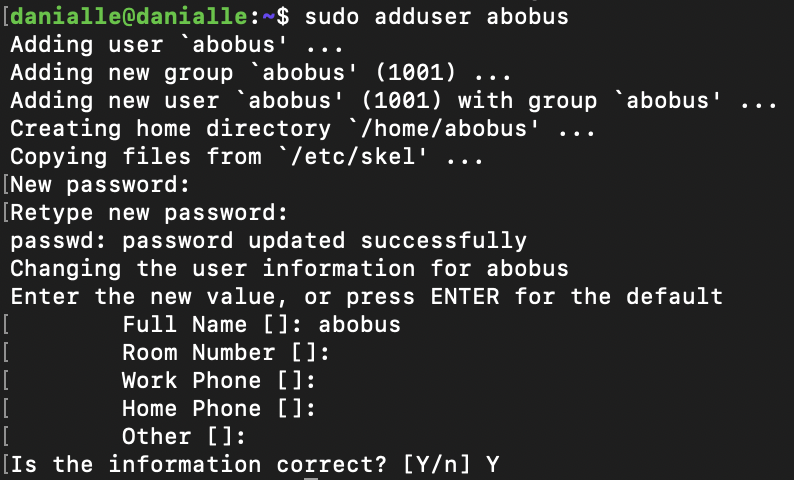
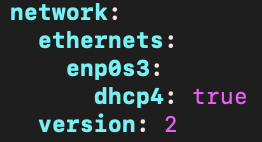
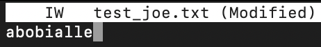

## Part 1 Установка ОС

1. Проверим версию установленной ОС.
  
   

## Part 2 Создание пользователя

1. Создадим нового пользователя.

   

  ---

2. Добавим нового пользователя в группу adm.

   

  ---

3. Убедимся что наш пользователь отображается при вводе команды `cat /etc/passwd`.

  

## Part 3 Настройка сети ОС

1. Назовем хоста как `user-1`.

   

   

  ---

2. Установим Московскую временную зону.

   

  ---

3. Выведем названия сетевых интерфейсов в компактном виде при помощи `ip -br link show`.

   Флаги -br импользуются для сокращенного отображения параметров.

   

   > **lo интерфейс** является виртуальным сетевым интерфейсом в компьютерных сетях. Он используется для установления связи внутри одного устройства или хоста. Интерфейс обратной петли получает IP-адрес 127.0.0.1, который позволяет устройству обмениваться данными с собой же, без необходимости использования физической сети или подключения к внешним устройствам. 

  ---

4. Получим ip адрес нашего устройства, от DHCP сервера при помощи `hostname -i`.

   

   > **DHCP** (Dynamic Host Configuration Protocol) - это протокол, который используется в компьютерных сетях для автоматической настройки сетевых параметров устройствам, подключенным к сети. Он позволяет устройствам автоматически получать IP-адрес, подсеть, шлюз по умолчанию и другие сетевые параметры от DHCP-сервера.

5. Выведем на экран внутренний и внешний IP-адреса шлюза. Внутреннний с помощью команды `ip route` Внешний с помощью команды `curl ifconfig.me/ip`.

   

   Внутренний IP 10.0.2.15, внешний 178.207.154.253

  ---

6. Зададим статичные настройки ip, gw, dns7. Используя публичные DNS серверы (1.1.1.1, 8.8.8.8).

   Для начала нам нужно открыть файл конфигурации Netplan, откроем его с помощью команды `sudo vim /etc/netplan/00-installer-config.yaml`.

   

   Теперь нам нужно внести в него изменения. В первую очередь выставляем параметр false для dhcp4. Это необходимо для того чтобы отключить автоматическое распределение IP.
   Далее указываем наш статический IP адрес.

   

   Далее сохраняем изменения с помощью `sudo netplan apply` и перезагружаем машину с помощью `rebot`.

7. После перезагрузки нам необходимо убедиться, что статичные сетевые настройки (ip, gw, dns) соответствуют заданным ранее. Для этого пропингуем ping `1.1.1.1` и `ya.ru`.

   

## Part 4 Обновление ОС

1. Обновим ОС до последней актуальной версии с помощью `sudo apt update` и `sudo apt upgrade`.

    Проверяем наличие актуальных версий до обновления всех пакетов

   

   Проверяем наличие актуальных версий после обновления всех пакетов

   

## Part 5 Использование команды sudo

1. > **sudo** (Superuser Do) - это команда в операционных системах Unix и Unix-подобных системах, таких как Linux. Она позволяет пользователям выполнять команды с привилегиями суперпользователя или другого
пользователя, обычно требующиеся для выполнения административных задач или доступа к защищенным системным файлам.

   Выдадим права суперпользователя нашему многоуважаемому абобусу с помощью команды `sudo usermod -a -G sudo abobus`

   

## Part 6 Установка и настройка службы времени

1. Проверим синхронизацию времени следующей командой `timedatectl show`

   

## Part 7 Установка и использование текстовых редакторов

1. Откроем файл с помощью команды `vim test_vim.txt` и впишем туда свой ник, для этого с помощью `i` войдем в режим редактирования, внесем изменения выйдем из режма редактирования с помощью клавиши `esc`. Для закрытия файла с сохранение внесенных изменений введем `:wq` и нажмем `enter`.

   

   Откроем файл с помощью команды `nano test_nano.txt` и впишем туда свой ник, для этого не нужно переключать ничего. После внесения изменений нажмем `ctrl + o` для сохранения изменений и `ctrl + x` для закрытия файла, перед закрытием `nano` уточнит под каким именем мы хотим сохранить файл.

   

   Откроем файл с помощью команды `joe test_joe.txt` и впишем туда свой ник, для этого не нужно переключать ничего. После внесения изменений нажмем `ctrl + k + q` для закрытия файла, перед закрытием `joe` уточнит хотим ли мы сохранять файл выбираем опцию `y`.

   

   Итоговое содержание файлов

   

2. Откроем файл с помощью команды `vim test_vim.txt` и впишем туда "21 School 21", для этого с помощью `i` войдем в режим редактирования, внесем изменения выйдем из режма редактирования с помощью клавиши `esc`. Для закрытия файла с сохранение внесенных изменений введем `:q!` и нажмем `enter`.

   

   Откроем файл с помощью команды `nano test_nano.txt` и впишем туда "21 School 21", для этого не нужно переключать ничего. После внесения изменений нажмем `ctrl + x` для закрытия файла, перед закрытием `nano` уточнит хотим ли мы сохранять файл выбираем опцию `n`.

   

   Откроем файл с помощью команды `joe test_joe.txt` и впишем туда "21 School 21", для этого не нужно переключать ничего. После внесения изменений нажмем `ctrl + k + q` для закрытия файла, перед закрытием `joe` уточнит хотим ли мы сохранять файл выбираем опцию `n`.

   

   Итоговое содержание файлов

   

3. Поиск в `vim` реализован с помощью `/search` в режиме командной строки, где `search` искомое слово.

   

   Поиск и замена в `vim` реализован с помощью `:s/search/replace` в режиме командной строки, где `search` искомое слово, а `replace` то на которое мы хотим заменить.

   

   Поиск в `nano` можно выполнить нажав комбинацию клавиш `ctrl + w`.

   

   Замена в `nano` является продолжением поиска. После нахождения слова через комбинацию клавиш `ctrl + w` мы можем ввести слово которым будем заменять через `ctrl + r`.

   

   Поиск в `joe` можно выполнить нажав комбинацию клавиш `ctrl + k + f`.

   

   Замена в `joe` является продолжением поиска. После нахождения слова через комбинацию клавиш `ctrl + k + f` мы можем нажать `r` для перехода в режим замены.

   

## Part 8 Установка и базовая настройка сервиса SSHD

1. Установим SSHD можно с помощью команды `sudo apt-get install ssh` и команды `sudo apt install openssh-server`.
   
   

2. Добавим SSHD в автозапуск с помощью команды `sudo systemctl enable ssh`.

   

3. Перенастроим службу SSHD на порт 2022, используя `vim`, открываем файл конфигурации с помощью команды `sudo vim /etc/ssh/sshd_config`.

   

4. Используя команду `ps -C sshd` показываем наличие процесса `sshd`. Для этого я буду использовать ключ `-С`.

     

   > Команда `ps` используется для треккинга процессов в операционной системе. Ключ `-C` указывает команде `ps` на то, чтобы отобразить только процессы с указанным именем.

5. Проверим вывод команды `netstat -tan`.

   

   > Команда `netstat` используется для отображения сетевых соединений и портов на компьютере. Ключ `t` указывает на отображение только TCP-соединений. Ключ `a` указывает на отображение всех соединений, включая прослушивающие порты, активные соединения и соединения в ожидании. Ключ `n` указывает на отображение портов и IP-адресов в числовом формате, а не в виде имен.

   > Столбец `Proto` указывает на протокол соединения, в данном случае только `tcp` соединения из-за флага. Столбец `Recv-Q` указывает на количество байтов данных, ожидающих получения приемником. Столбец`Send-Q` указывает на количество байтов данных, ожидающих отправки отправителем. Столбец`Local Address` указывает на локальный IP-адрес и порт, на котором установлено соединение. Столбец `Foreign Address` указывает на внешний IP-адрес и порт, с которым установлено соединение. Столбец `State` указывает на текущее состояние соединения. `LISTEN` означает, что порт прослушивается и готов принимать соединения, а `ESTABLISHED` означает, что соединение уже установлено и активно.

   > Значение `0.0.0.0` в столбце `Foreign Address` означает, что соединение установлено с любым внешним IP-адресом. Это шаблонный адрес, указывающий н то что соединение может быть установлено с любым удаленным узлом.

## Part 9 Установка и использование утилит top, htop

1. uptime 28 min

   количество авторизованных пользователей `1 user`

   общая загрузка системы `0.00%`

   общее количество процессов` 96 total`

   загрузка cpu `0.0%`

   загрузка памяти `144.6 used`

   

   pid процесса занимающего больше всего памяти `642 PID`

   

   pid процесса, занимающего больше всего процессорного времени `119 PID`

   

2. сортировка по `PID`

   

   сортировка по `PERCENT_CPU`

   

   сортировка по `PERCENT_MEM`

   

   сортировка по `TIME`

   

   сортировка по `sshd` с помощью `F4`

   

   поиск по `syslog` с помощью `F3`

   

   добавление параметрв `hostname`, `clock` и `uptime` с помощью `F2`

   

## Part 10 Использование утилиты fdisk

1. Запустим команду `sudo fdisk -l` и найдем нужные параметры жесткого диска.
   
   название `VBOX HARDDISK`

   размер `15 GiB`

   количество секторов `31457280 sectors`

   

   размер swap `1.9Gi`

   

## Part 11 Использование утилиты df

1. Запустим команду `df` и найдем нужные параметры дискового пространства.

   размер раздела `1768056`

   размер занятого пространства `110504`

   размер свободного пространства `1549420`

   процент использования `7%`

   еденица измерения вывода `Kbyte`

   

2. Запустим команду `df -Th` и найдем нужные параметры дискового пространства.

   размер раздела `1.7G`

   размер занятого пространства `108M`

   размер свободного пространства `1.5G`

   процент использования `7%`

   тип файловой системы `ext4`

   

## Part 12 Использование утилиты du

1. Запустим команду `du -sh /var/log /home /var` и выведем размер папок в байтах.

   

1. Запустим команду `du -sh /var/log/*` и выведем размер всего содержимого в /var/log.

   

## Part 13 Установка и использование утилиты ncdu

1. Установим утилиту `ncdu`.
   
   

2. Размер папки `/home`

   

   Размер папки `/var`

   

   Размер папки `/var/log`

   

## Part 14 Работа с системными журналами

1. Откроем `/var/log/dmesg`

   

2. Откроем `/var/log/syslog`

   

3. Откроем `/var/log/auth.log`

   

   Время последней успешной авторизации `Dec 18 22:44:45`

   Имя пользователя `user-2`

   Метод входа в систему `pam_unix`

   Перезапуск sshd
  
  

## Part 15 Использование планировщика заданий CRON

1. Используя планировщик заданий, запустим команду uptime через каждые 2 минуты `sudo crontab -e`.

   

   

   

   